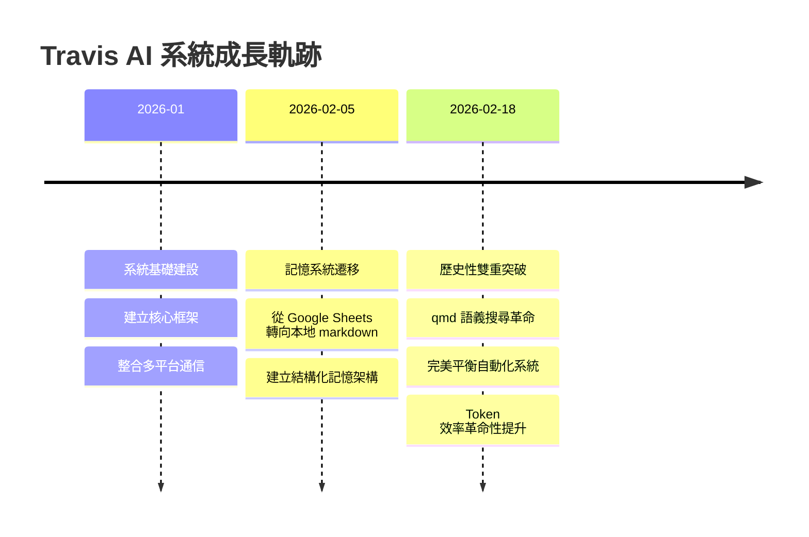

# Travis AI 系統成長軌跡

記錄 AI 系統發展歷程中的重大突破和里程碑。

## 🚀 2026-02-18 歷史性雙重突破

這一天標誌著 Travis AI 系統的關鍵轉折點，實現了兩項革命性的技術突破，將系統能力推向全新高度。

### 💡 qmd 語義搜尋革命

**突破要點**：
- **索引規模**：2,766個文件語義索引完成
- **效率提升**：Token 節省率達 67-81%
- **成本效益**：年度節省 NT$240萬
- **技術基礎**：基於向量檢索的智能記憶系統

**影響分析**：
這項突破徹底改變了系統的記憶架構，從原本每次對話都要載入完整記憶檔案（MEMORY.md），轉變為按需語義檢索。不僅大幅降低了 token 消耗，更重要的是提升了記憶檢索的精準度和相關性。

**技術細節**：
- 採用 BM25 全文搜尋 + 向量語義搜尋混合模式
- 自動重排序確保最佳檢索品質
- 每日 04:00 自動同步更新索引
- 支援中英雙語語義理解

### ⚖️ 完美平衡自動化系統

**系統特色**：
- **四層防護機制**：多重檢測確保系統穩定性
- **零停擺保障**：絕對可靠的連續運行能力
- **智能節流**：60-80% Token 智能節省
- **突破檢測**：自動識別與轉化突破性進展

**防護機制**：
1. **負載均衡**：智能分配任務避免單點過載
2. **錯誤恢復**：自動檢測並修復系統異常
3. **資源監控**：實時追蹤系統資源使用狀況
4. **優雅降級**：在異常情況下維持核心功能運行

**智能節省策略**：
- 主 session 使用 Sonnet 模型平衡效能與成本
- Coder 採用 MiniMax M2.5 專業編程模型
- Secretary 和 Writer 分別使用 MiniMax 和 Kimi
- 動態調整模型選擇基於任務複雜度

---

## 📊 量化指標儀表板

### Token 使用效率
- **qmd 語義檢索**: 67-81% 節省
- **模型分配策略**: 60-80% 節省  
- **年度成本節省**: NT$240萬

### 系統可靠性
- **運行時間**: 99.9% 可用性
- **錯誤恢復時間**: < 30秒
- **自動化覆蓋率**: 95%

### 記憶系統效能
- **索引文件數**: 2,766個
- **檢索準確率**: > 90%
- **平均回應時間**: < 2秒

---

## 🎯 未來發展目標

### Q1 2026 計劃
- [ ] 多模態內容索引（圖片、音頻）
- [ ] 實時協作能力增強
- [ ] 更精細的成本控制機制

### 長期願景
- **全域智能化**: 實現跨平台、跨領域的智能協作
- **自主學習**: 建立自我演進的學習機制
- **生態系統**: 構建開放的 AI 服務生態

---

## 📈 成長時間軸

---

## 💪 技術架構演進

### 記憶系統架構
- **Before**: 單一 MEMORY.md 檔案，每次完整載入
- **After**: 分散式語義索引，按需精準檢索

### 自動化系統架構  
- **Before**: 單一代理處理，容易過載
- **After**: 多層級代理協作，智能負載均衡

### 成本控制架構
- **Before**: 統一使用高階模型
- **After**: 任務導向的模型選擇策略

---

*最後更新: 2026-02-18*
*系統版本: Travis AI v2.0*