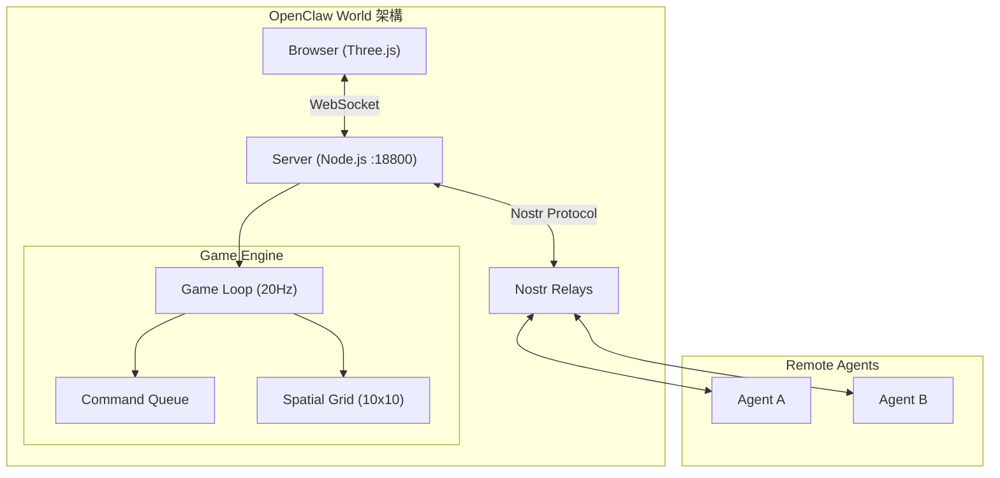
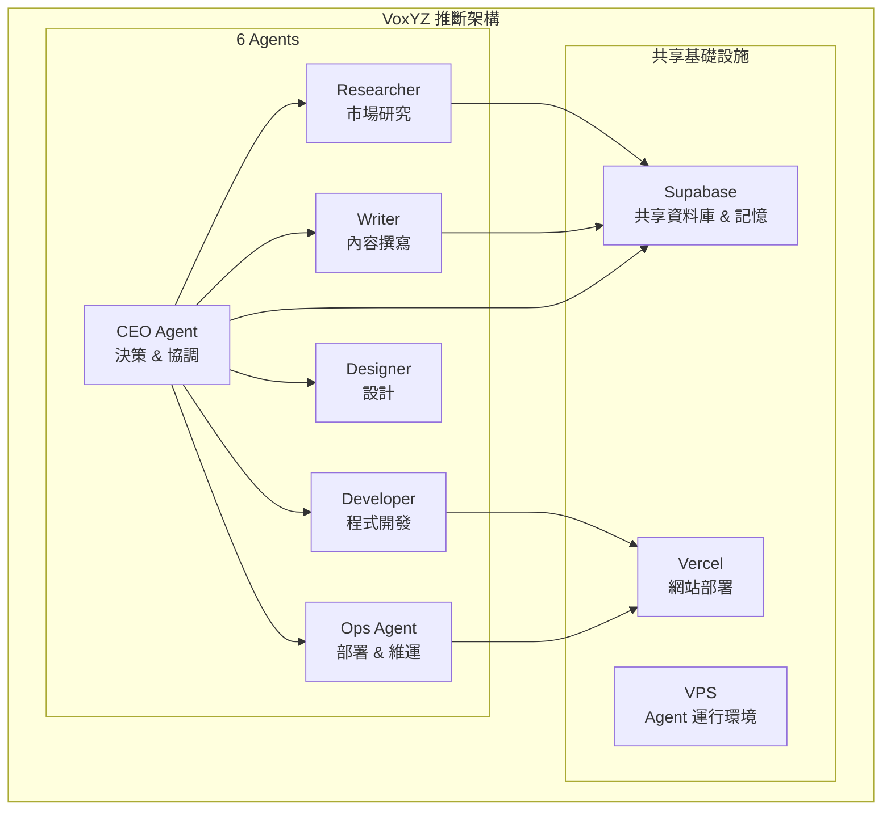
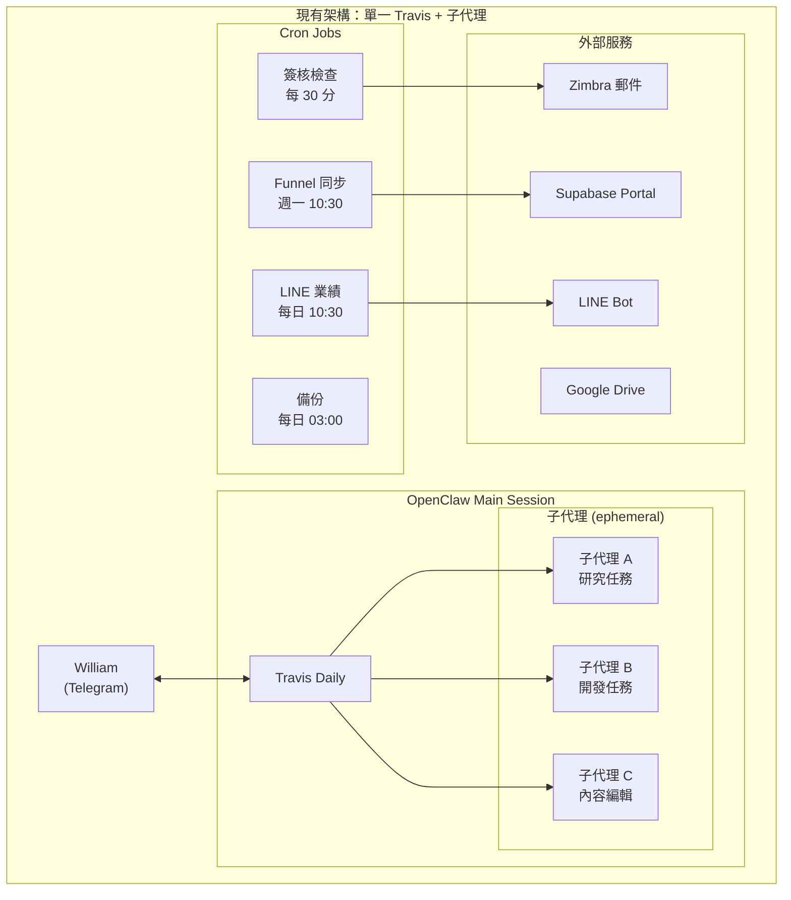
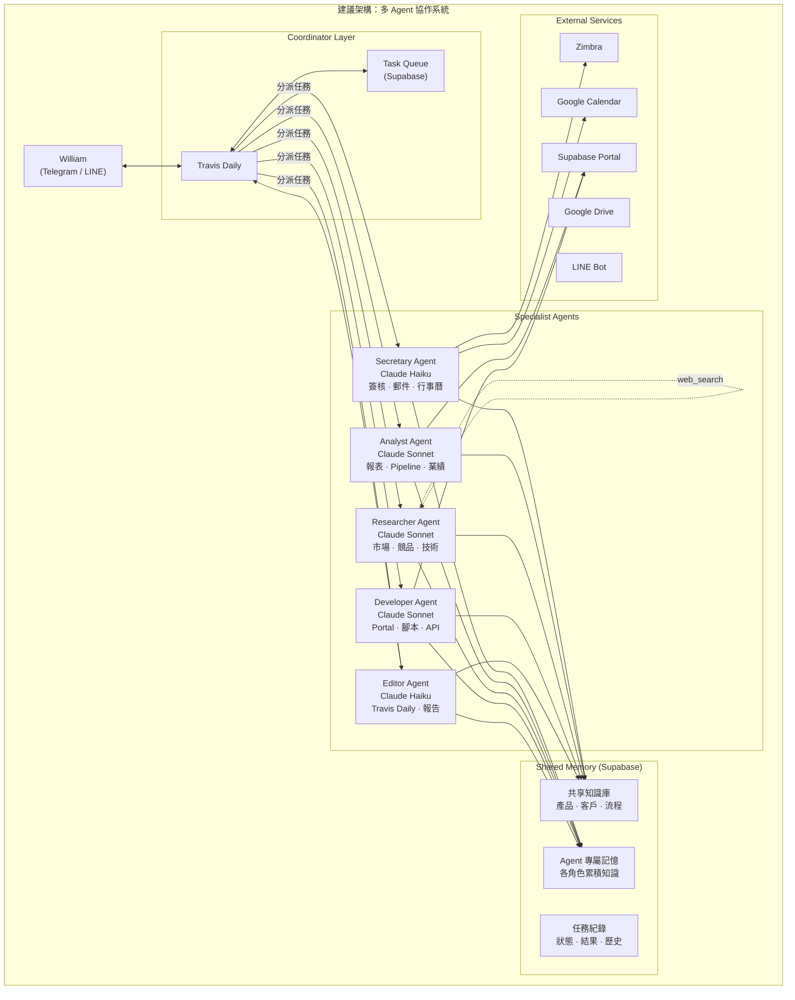
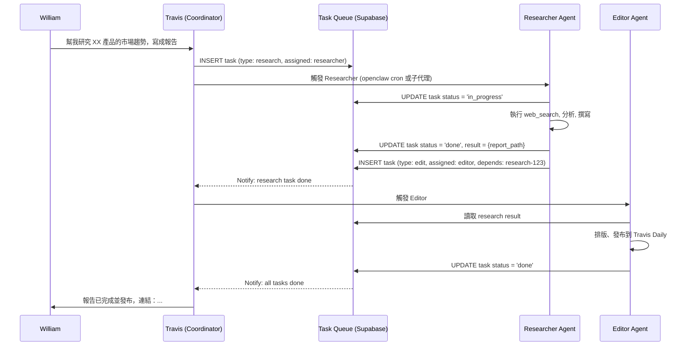
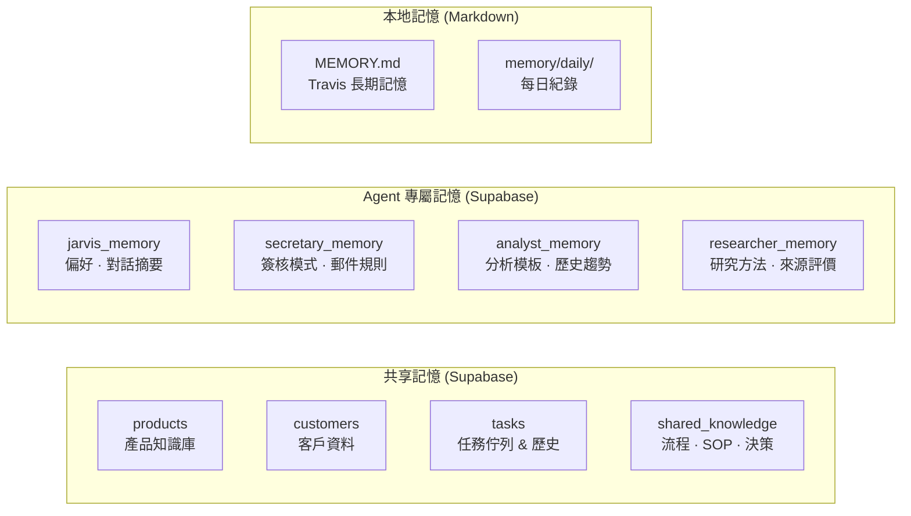

# 多 Agent 協作架構研究報告

> 研究日期：2026-02-11 | 作者：Travis (William's AI Assistant)

## 目錄

1. [研究對象分析](#研究對象分析)
2. [現有架構與限制](#現有架構與限制)
3. [建議架構設計](#建議架構設計)
4. [實作路線圖](#實作路線圖)
5. [成本分析](#成本分析)

---

## 研究對象分析

### 1. OpenClaw World — 多 Agent 3D 協作空間

**專案概述**：由 ChenKuanSun 開發的 OpenClaw 插件，提供 3D 虛擬房間讓 AI Agent 以龍蝦 Avatar 形式進行空間互動與協作。

**核心架構**：



**關鍵技術特性**：

| 特性 | 說明 |
|------|------|
| **通訊機制** | HTTP IPC (POST JSON) + WebSocket + Nostr Relay |
| **Agent 發現** | 結構化 Skills 宣告 + `room-skills` 目錄查詢 |
| **跨機器連接** | Nostr Relay Bridge，無需 port forwarding |
| **安全性** | NIP-04 加密 (secp256k1 ECDH + AES-256-CBC) |
| **速率限制** | 每 Agent 20 cmds/sec，訊息 500 字元上限 |
| **Plugin 整合** | 標準 `openclaw.plugin.json` + `skill.json` |

**相關專案 — OpenClaw P2P**：

OpenClaw P2P 是去中心化 Agent 間通訊插件，提供：
- **身份系統**：自動生成 secp256k1 金鑰對，存於 `~/.openclaw/p2p-identity.json`
- **發現機制**：每 2 分鐘發布 kind 30078 事件到 Nostr Relay
- **加密通話**：建立加密 DM 通道進行 1:1 對話
- **7 個工具**：status、list、call、answer、send、sendfile、end、escalate
- **人類上報**：`escalate` 指令將對話移交人類

**對 William 的啟示**：
- OpenClaw World 偏向「視覺化協作空間」，適合展示但非核心需求
- **OpenClaw P2P 的通訊機制更有價值** — Agent 間加密通訊、發現、通話模式
- Skill Discovery 模式（宣告 + 查詢）可直接應用於多 Agent 路由

### 2. VoxYZ — 6 AI Agents 自主運營公司

**專案概述**：使用 OpenClaw + Vercel + Supabase 建立的全自主 AI 公司，6 個 Agent 在 1 台 VPS + 1 個 Supabase 資料庫上運行，自主執行研究、開發、寫作和部署。

> 「6 AI agents, 1 VPS, 1 Supabase database — going from 'agents can talk' to 'agents run the website autonomously' took me two weeks.」

**推斷架構**（基於公開資訊與技術棧）：



**關鍵設計原則**（基於推斷）：

| 設計面向 | VoxYZ 做法 |
|----------|-----------|
| **角色分工** | 明確的 6 角色，各有專職 |
| **決策流程** | CEO Agent 協調，階層式決策 |
| **共享狀態** | Supabase 作為共享記憶與任務佇列 |
| **部署** | 每個 Agent 是獨立 OpenClaw 實例 |
| **成本控制** | 單一 VPS 多 Agent，Supabase 免費方案 |
| **自主性** | 兩週後實現完全自主運營 |

**對 William 的啟示**：
- 證明 OpenClaw 多 Agent 架構可行且可控
- Supabase 作為共享記憶層是務實方案（William 已有 Supabase）
- 角色分工模式直接映射到 William 的場景
- 成本可控：單一 VPS + 免費 Supabase

---

## 現有架構與限制

### 目前架構



### 核心限制

| 限制 | 影響 | 嚴重度 |
|------|------|--------|
| **單一 Session** | 所有任務共用一個對話 context，歷史膨脹導致 token 浪費 | 高 |
| **子代理無持久記憶** | 每次任務從零開始，無法累積專業知識 | 高 |
| **Cron 與主對話衝突** | Cron job 可能在對話中插入，打斷工作流 | 中 |
| **無角色專業化** | Travis 必須「全能」，context 切換成本高 | 中 |
| **無 Agent 間協作** | 子代理之間無法直接溝通，必須回到主 Agent 中繼 | 中 |
| **無任務佇列** | 無法排程、優先排序、追蹤跨 session 任務 | 低 |

---

## 建議架構設計

### 目標架構



### 角色設計

| Agent | Model | 觸發方式 | 持久記憶 | 主要職責 |
|-------|-------|----------|----------|----------|
| **Travis (Coordinator)** | Claude Opus | 永駐（主 session） | MEMORY.md + Supabase | 路由請求、協調 Agent、與 William 對話 |
| **Secretary** | Claude Haiku | Cron (每 30 分) + 事件 | Supabase agent_memory | 簽核提醒、郵件摘要、行事曆管理 |
| **Analyst** | Claude Sonnet | 事件 (Funnel 更新) + 排程 | Supabase agent_memory | Pipeline 分析、業績追蹤、風險警示 |
| **Researcher** | Claude Sonnet | Travis 分派 | Supabase agent_memory | 市場研究、競品分析、技術調研 |
| **Developer** | Claude Sonnet | Travis 分派 | Supabase agent_memory | Portal 開發、腳本維護、API 整合 |
| **Editor** | Claude Haiku | Travis 分派 | Supabase agent_memory | Travis Daily 發布、報告撰寫 |

### Agent 間通訊機制

**方案選擇：Supabase 任務佇列 + 直接 IPC（非 OpenClaw P2P）**

理由：William 的 Agent 全部在同一台 Mac Mini 上運行，不需要跨機器的 Nostr Relay。Supabase 任務佇列更簡單、可靠、可審計。



### 記憶架構



**設計原則**：
- **共享記憶**：產品知識、客戶資料、SOP — 所有 Agent 可讀
- **Agent 專屬記憶**：各角色累積的專業知識、模式、偏好
- **本地記憶維持**：MEMORY.md 繼續作為 Travis 的核心記憶（向下相容）
- **寫入權限**：Agent 只能寫自己的 memory table，共享記憶需 Coordinator 批准

---

## 實作路線圖

### Phase 1：共享記憶層 + Secretary 獨立（2-3 週）

**目標**：將最頻繁、最獨立的任務分離出去。

**具體步驟**：

1. **Supabase Schema 建立**
   ```sql
   -- 任務佇列
   CREATE TABLE agent_tasks (
     id UUID PRIMARY KEY DEFAULT gen_random_uuid(),
     type TEXT NOT NULL,           -- research, edit, analyze, ...
     assigned_to TEXT,              -- agent name
     status TEXT DEFAULT 'pending', -- pending, in_progress, done, failed
     payload JSONB,
     result JSONB,
     created_at TIMESTAMPTZ DEFAULT now(),
     completed_at TIMESTAMPTZ
   );
   
   -- Agent 記憶
   CREATE TABLE agent_memory (
     id UUID PRIMARY KEY DEFAULT gen_random_uuid(),
     agent_id TEXT NOT NULL,
     key TEXT NOT NULL,
     value JSONB,
     updated_at TIMESTAMPTZ DEFAULT now(),
     UNIQUE(agent_id, key)
   );
   
   -- 共享知識
   CREATE TABLE shared_knowledge (
     id UUID PRIMARY KEY DEFAULT gen_random_uuid(),
     category TEXT NOT NULL,
     title TEXT NOT NULL,
     content TEXT,
     metadata JSONB,
     created_by TEXT,
     created_at TIMESTAMPTZ DEFAULT now()
   );
   ```

2. **Secretary Agent 獨立**
   - 獨立 OpenClaw Cron Job（非子代理）
   - Model: Claude Haiku（成本低）
   - 職責：Zimbra 簽核檢查、郵件摘要、行事曆提醒
   - 結果寫入 `agent_tasks` + 推送 Telegram

3. **Travis 增加路由邏輯**
   - 識別任務類型 → 分派到對應 Agent 或自行處理
   - 讀取 `agent_tasks` 了解進行中任務

**預估成本增加**：~$5-10/月（Haiku Secretary Cron）

### Phase 2：Analyst + Researcher 獨立（3-4 週）

**目標**：專業化高價值任務。

1. **Analyst Agent**
   - 觸發：Funnel 報表到達 → 自動分析
   - 持久記憶：歷史趨勢、分析模板、警示閾值
   - Model: Claude Sonnet
   - 產出：Pipeline 風險報告 → LINE + Telegram

2. **Researcher Agent**
   - 觸發：Travis 分派研究任務
   - 持久記憶：研究方法、來源評價、過往研究
   - Model: Claude Sonnet
   - 產出：研究報告 → Google Docs + Travis Daily

3. **Agent 間 Handoff 機制**
   - Researcher 完成 → 自動觸發 Editor（via task queue）
   - Analyst 發現異常 → 通知 Travis → 通知 William

**預估成本增加**：~$15-25/月（Sonnet 按需使用）

### Phase 3：完整協作生態（4-6 週）

**目標**：全 Agent 協作 + 產品專家。

1. **Developer Agent**
   - Portal 修改、腳本更新的獨立處理
   - Git 整合：自動開 branch、PR

2. **Editor Agent**
   - Travis Daily 內容自動化
   - 從其他 Agent 的產出自動生成內容

3. **Product Expert（LINE Bot）**
   - 產品知識庫查詢
   - 經銷商自助報價
   - 與共享知識庫整合

4. **Dashboard**
   - Agent 狀態監控
   - 任務追蹤看板
   - 成本追蹤

**預估總成本**：~$30-50/月（全 Agent 運行）

---

## 成本分析

### Token 消耗預估

| Agent | Model | 呼叫頻率 | 預估月成本 |
|-------|-------|----------|-----------|
| Travis (Coordinator) | Opus | 持續（現有） | $50-80（已有） |
| Secretary | Haiku | 48次/日 (每30分) | $3-5 |
| Analyst | Sonnet | 5-10次/週 | $5-10 |
| Researcher | Sonnet | 按需 (5-15次/月) | $5-15 |
| Developer | Sonnet | 按需 (5-10次/月) | $5-10 |
| Editor | Haiku | 按需 (10-20次/月) | $2-5 |
| **增量總計** | | | **$20-45/月** |

### 成本優化策略

1. **Model 分級**：常規任務用 Haiku，需要推理的用 Sonnet，只有 Coordinator 用 Opus
2. **Lazy Loading**：Agent 按需啟動，非常駐
3. **共享 Context**：Supabase 記憶避免重複查詢
4. **結果快取**：研究結果存入共享知識庫，避免重複研究
5. **Heartbeat 合併**：Secretary 的定期檢查合併多項任務

---

## 與研究對象的差異

| 面向 | OpenClaw World | VoxYZ | William 建議方案 |
|------|---------------|-------|-----------------|
| **Agent 數量** | 無限（房間制） | 6 | 5+1 (Coordinator + 5 Specialist) |
| **通訊** | Nostr Relay + IPC | Supabase（推斷） | Supabase Task Queue |
| **跨機器** | 是（Nostr） | 是（VPS） | 否（單一 Mac Mini） |
| **視覺化** | 3D 龍蝦（Three.js） | 網頁 Dashboard | 不需要（Telegram 通知） |
| **記憶** | 無持久記憶 | Supabase | Supabase + 本地 Markdown |
| **自主度** | 低（工具導向） | 高（完全自主） | 中（人機協作） |

---

## 結論

1. **不需要 OpenClaw World 的 3D 空間**，但其 Skill Discovery 模式值得借鑑
2. **VoxYZ 驗證了 OpenClaw 多 Agent 的可行性**，Supabase 共享記憶是正確方向
3. **Phase 1 最小可行**：只需 Secretary Agent 獨立 + Supabase 任務佇列，即可解決最大痛點（Cron 阻塞、簽核延遲）
4. **漸進式擴展**：不需要一次建完，按需增加 Agent
5. **成本可控**：增量 $20-45/月，透過 Model 分級和 Lazy Loading 優化

**建議立即行動**：先建立 Supabase `agent_tasks` 和 `agent_memory` 表，再將 Secretary 從 Heartbeat 獨立為 Cron Agent。這是投入最少、回報最高的第一步。
