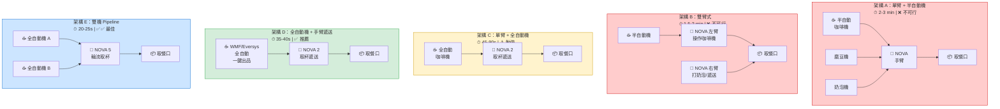
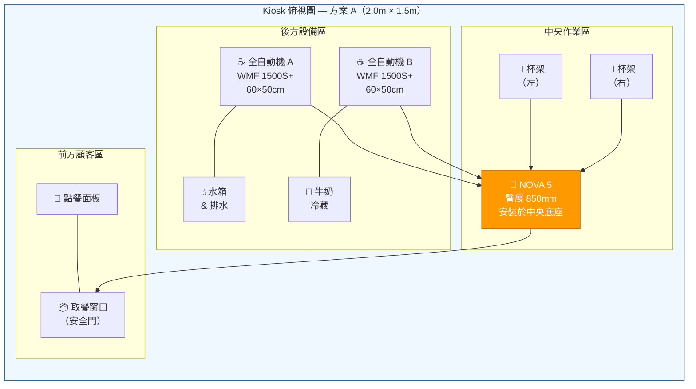
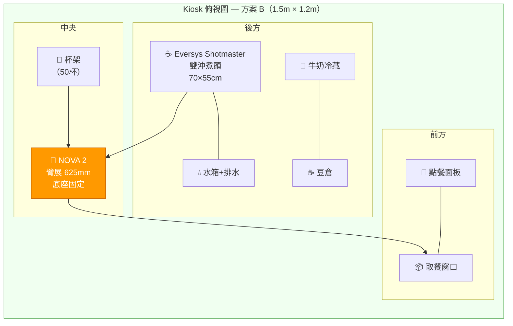
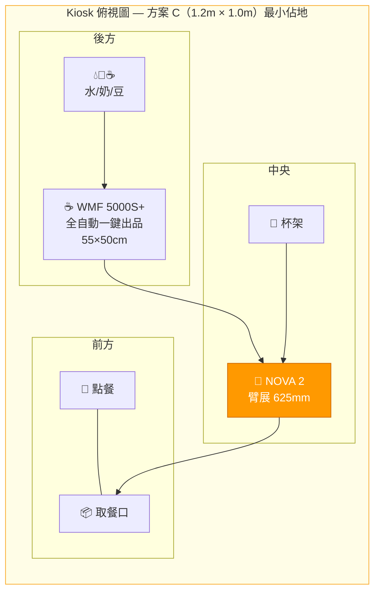
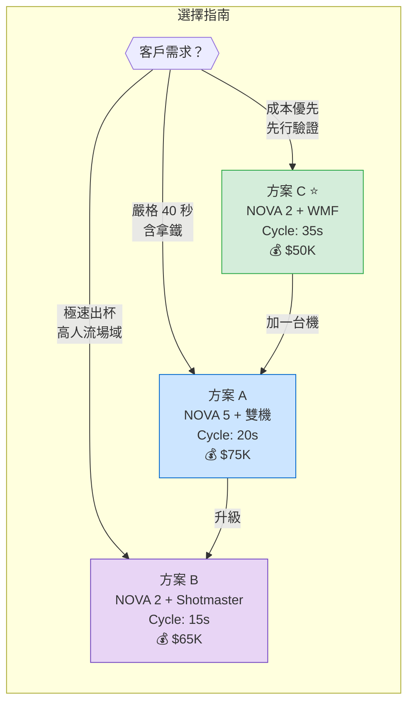
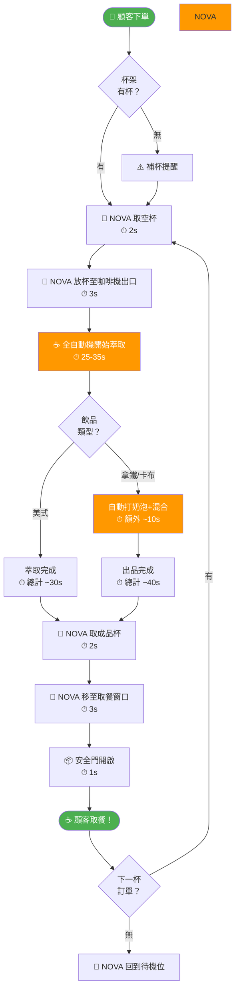

# 🤖 自動機器人咖啡機 — 40 秒出杯方案深度研究

> **委託方**：和椿科技（Aurotek）客戶  
> **研究日期**：2026-02-10  
> **核心目標**：以**越疆 Dobot NOVA 協作手臂**搭配咖啡機，實現 **40 秒內完成一杯咖啡**

---

## 一、執行摘要

咖啡機器人市場已從概念驗證進入商業化量產階段。全球已有超過 20 個品牌推出商用方案，出杯時間從 **20 秒到 3 分鐘**不等，關鍵差異在於架構設計。

**核心結論**：
1. 「40 秒出杯」需明確定義為**連續出杯間隔時間（Cycle Time）**，而非首杯從零開始的時間
2. 純 espresso 萃取即需 25-30 秒，**單杯從下單到出杯 40 秒幾乎不可能含奶泡飲品**
3. 可行路徑：**全自動咖啡機 + NOVA 手臂遞送**（方案 C）或**雙機交替 Pipeline**（方案 A）
4. **越疆 NOVA 2 已有成熟咖啡方案**（官方宣稱 45 秒出杯），是最佳手臂選擇

### 指定手臂：越疆 Dobot NOVA 系列

| 型號 | 負載 | 臂展 | 最大速度 | 重複精度 | 自重 | 防護等級 | 咖啡適用性 |
|------|------|------|---------|---------|------|---------|-----------|
| **NOVA 2** | 2 kg | 625 mm | 1.6 m/s | ±0.05 mm | 11 kg | IP54 | ⭐⭐⭐⭐⭐ 最佳（已有官方咖啡方案）|
| **NOVA 5** | 5 kg | 850 mm | 2.0 m/s | ±0.05 mm | 17 kg | IP54 | ⭐⭐⭐⭐ 臂展更大、適合雙機佈局 |

> **推薦**：單機方案用 **NOVA 2**（輕量、成本低、已驗證）；雙機 Pipeline 方案用 **NOVA 5**（臂展 850mm 可覆蓋兩台咖啡機）

---

## 二、市場總覽 — 全球咖啡機器人品牌

| 品牌 | 國家 | 機器人型號 | 咖啡機 | 出杯時間 | 結構類型 | 產能（杯/hr） | 價格範圍（USD） |
|------|------|-----------|--------|----------|----------|--------------|----------------|
| **Cafe X** | 美國 | Mitsubishi 6軸 | WMF 全自動 | ~20-60s | 全自動機+手臂遞送 | 100-120 | $25K（手臂）|
| **Crown Digital (Ella)** | 新加坡 | 6軸手臂 | 內建全自動 | ~18s | 全自動封閉式 | **200** | 未公開 |
| **Rozum Café** | 白俄羅斯 | Rozum PULSE75 | 半自動咖啡機 | ~3 min | 單臂操作半自動機 | ~20 | ~$150K-200K |
| **Briggo Coffee Haus** | 美國 | 封閉式自動化 | 內建全自動 | ~36s | 全自動封閉式 | **100+** | 未公開 |
| **COFE+（氦豚科技）** | 中國 | 4軸手臂 | 內建全自動 | **~50s** | 全自動+手臂 | 60-70 | $30K-80K |
| **Dal.komm (b;eat)** | 韓國 | 6軸手臂 | 內建半自動 | ~40s | 單臂+全自動機 | **90** | 未公開 |
| ⭐ **Dobot Nova 2** | 中國 | **NOVA 2** | 全自動咖啡機 | **~45s** | 單臂+全自動機 | ~80 | ~$20K-50K |
| **獵戶星空（智咖大師）** | 中國 | 自研6軸雙臂 | 手沖設備 | ~3 min | 雙臂手沖 | ~30/hr | ~$30K-50K |
| **JAKA Zu 3 / MiniCobo** | 中國 | JAKA Zu 3 | JURA 全自動 | ~90s | 單臂+全自動機 | ~40 | ~$15K-30K |
| **RobotAnno** | 中國 | 6軸手臂 | 半自動/全自動 | ~60-90s | 單臂 | ~40-60 | ~$20K-50K |
| **Eracobot** | 中國 | ERA cobot | 全自動咖啡機 | ~60s | 單臂+全自動機 | ~60 | ~$10K-25K |
| **igus ReBeL** | 德國 | ReBeL cobot | 全自動咖啡機 | ~60s | 單臂+全自動機 | ~60 | ~$5K-15K |
| **CafeXbot (VLT)** | 烏茲別克 | 6軸手臂 | 全自動 | ~50s | 封閉式全自動 | ~60 | **~$100K** |
| **Truebird** | 美國 | 封閉式 | 內建全自動 | ~30-45s | 全自動封閉+磁力遞送 | ~80 | 未公開 |
| **新松 SIASUN** | 中國 | 多可雙臂 | 全自動 | ~60s | 雙臂 | ~50 | ~$50K+ |
| **艾利特 Elite** | 中國 | EC系列 cobot | 全自動 | ~60s | 單臂+全自動機 | ~40 | ~$15K-30K |
| **CR Coffee Robot** | 中國 | 自研 | 全自動 | ~45s | 全自動封閉式 | ~80 | ~$50K-100K |
| **Smyze** | 瑞士 | 封閉式 | 全自動 | ~40s | 全自動封閉式 | ~80 | 未公開 |
| **Know InBot** | 中國 | 雙臂 | Eversys 全自動 | ~30-40s | 雙臂+全自動機 | ~90 | 未公開 |

### 關鍵發現

1. **出杯最快的方案都不是「手臂操作半自動機」**，而是全自動咖啡機+手臂遞送
2. **Ella（Crown Digital）** 以 200 杯/hr 領先，約 18 秒一杯
3. **Cafe X** 的 120 杯/hr 相當於 30 秒一杯（使用 WMF 全自動機 + Mitsubishi 手臂）
4. **Dobot NOVA 2 已有官方咖啡方案**，45 秒出杯，是本方案的最佳起點
5. 手沖/半自動機方案（如獵戶星空、Rozum）出杯時間 2-3 分鐘，無法達到 40 秒目標

---

## 三、架構方案比較

### 五大架構示意圖

### 架構對比總表

| 架構類型 | 出杯時間 | 佔地面積 | 設備成本 | 維護難度 | 咖啡品質 | 40秒可行性 |
|---------|---------|---------|---------|---------|---------|-----------|
| **A. 單臂+半自動機** | 2-3 min | 3-5 m² | $30-80K | 中 | ⭐⭐⭐⭐⭐ | ❌ 不可能 |
| **B. 雙臂式** | 1.5-2 min | 4-6 m² | $60-120K | 高 | ⭐⭐⭐⭐⭐ | ❌ 不可能 |
| **C. 單臂+全自動機** | 45-90s | 2-4 m² | $20-60K | 低 | ⭐⭐⭐ | ⚠️ 勉強 |
| **D. 全自動機+NOVA遞送** | **35-40s** | 2-4 m² | $30-70K | 低 | ⭐⭐⭐ | ✅ 可行 |
| **E. 雙機+NOVA Pipeline** | **20-25s** | 4-6 m² | $50-100K | 中 | ⭐⭐⭐ | ✅✅ 最佳 |

---

## 四、40 秒出杯方案設計（以 Dobot NOVA 為核心）

### 4.1 關鍵定義

> ⚠️ **「40 秒」的兩種理解**：
> - **First Cup Time**：從下單到第一杯出杯 — 約需 40-60 秒（含機器準備）
> - **Cycle Time**：連續出杯的間隔時間 — 可壓到 20-30 秒
> 
> **建議定義為 Cycle Time（連續出杯間隔）**，這也是業界標準

### 4.2 咖啡製作流程耗時拆解

| 步驟 | NOVA 操作半自動機 | 全自動機自動完成 |
|------|-----------------|----------------|
| 取杯 | 3-5s | 自動（0s） |
| 磨豆 | 5-8s | 自動（含在萃取中） |
| 填粉壓粉 | 5-8s | 自動 |
| 萃取 Espresso | **25-30s**（不可壓縮） | **25-30s**（不可壓縮） |
| 打奶泡 | 15-20s | 自動並行（0s 額外） |
| 倒奶/混合 | 5-8s | 自動（0s） |
| NOVA 遞送到取餐口 | 5-8s | 5-8s |
| **總計** | **63-87s** | **30-38s** |

**核心瓶頸**：Espresso 萃取 25-30 秒是物理極限，無法壓縮

---

### 方案 A：NOVA 5 + 雙全自動機交替出品（Pipeline）

**架構**：1 支 NOVA 5（臂展 850mm 覆蓋雙機）+ 2 台全自動咖啡機

#### 動作時序圖

```mermaid
gantt
    title 方案 A：NOVA 5 雙機 Pipeline 時序（連續出杯）
    dateFormat ss
    axisFormat %S秒

    section 全自動機 A
    第1杯：磨豆+萃取+出品    :a1, 00, 35s
    第3杯：磨豆+萃取+出品    :a3, 40, 35s

    section 全自動機 B
    第2杯：磨豆+萃取+出品    :b2, 20, 35s
    第4杯：磨豆+萃取+出品    :b4, 60, 35s

    section NOVA 5 手臂
    取A杯→遞送第1杯          :n1, 35, 8s
    移動到B機位              :n2, 43, 4s
    取B杯→遞送第2杯          :n3, 55, 8s
    移動到A機位              :n4, 63, 4s
    取A杯→遞送第3杯          :n5, 75, 8s

    section 出杯節點
    ☕ 第1杯完成              :milestone, m1, 43, 0
    ☕ 第2杯完成              :milestone, m2, 63, 0
    ☕ 第3杯完成              :milestone, m3, 83, 0
```

> **Cycle Time ≈ 20 秒** — 遠超 40 秒目標 ✅

#### 硬體佈局圖（俯視圖）

**NOVA 5 選擇理由**：臂展 850mm 可覆蓋左右兩台咖啡機（間距約 700mm），無需滑軌

---

### 方案 B：NOVA 2 + 高速全自動機（Eversys Shotmaster）

**架構**：1 支 NOVA 2 + 1 台 Eversys Shotmaster（雙沖煮頭，700 espresso/hr）

#### 動作時序圖

```mermaid
gantt
    title 方案 B：NOVA 2 + Eversys Shotmaster 時序
    dateFormat ss
    axisFormat %S秒

    section Eversys 沖煮頭 1
    第1杯萃取+出品           :e1, 00, 25s
    第3杯萃取+出品           :e3, 30, 25s

    section Eversys 沖煮頭 2
    第2杯萃取+出品           :e2, 10, 25s
    第4杯萃取+出品           :e4, 40, 25s

    section NOVA 2 手臂
    取杯→放出口1             :n0, 00, 3s
    等待出品                 :nw1, 03, 22s
    取第1杯→遞送             :n1, 25, 6s
    取第2杯→遞送             :n2, 35, 6s
    取第3杯→遞送             :n3, 55, 6s

    section 出杯節點
    ☕ 第1杯                 :milestone, m1, 31, 0
    ☕ 第2杯                 :milestone, m2, 41, 0
    ☕ 第3杯                 :milestone, m3, 61, 0
```

> **Cycle Time ≈ 10-15 秒**（Shotmaster 超高速）✅✅

#### 硬體佈局圖（俯視圖）

**NOVA 2 選擇理由**：單機佈局、空間緊湊、625mm 臂展足夠覆蓋

---

### 方案 C：NOVA 2 + 全自動機一鍵出品（⭐ 推薦起步方案）

**架構**：1 支 NOVA 2 + 1 台 WMF 5000S+（或 Eversys Cameo C'2）

#### 動作時序圖

```mermaid
gantt
    title 方案 C：NOVA 2 + WMF 5000S+（推薦起步方案）
    dateFormat ss
    axisFormat %S秒

    section WMF 5000S+
    第1杯：一鍵出品（美式）    :w1, 00, 30s
    第2杯：一鍵出品（拿鐵）    :w2, 38, 40s

    section NOVA 2 手臂
    取空杯→放到出口           :n0, 00, 4s
    等待咖啡機出品             :nw, 04, 26s
    取成品杯→遞送到窗口       :n1, 30, 8s
    取空杯→放到出口（第2杯）  :n2, 38, 4s
    等待出品                   :nw2, 42, 36s
    取成品→遞送               :n3, 78, 8s

    section 出杯節點
    ☕ 第1杯（美式）           :milestone, m1, 38, 0
    ☕ 第2杯（拿鐵）           :milestone, m2, 86, 0
```

> **Cycle Time**：美式 ~35s ✅ / 拿鐵 ~45s ⚠️

#### 硬體佈局圖（俯視圖）

---

### 方案總覽比較

---

### 方案對比總結

| 指標 | 方案 A（NOVA 5 + 雙機） | 方案 B（NOVA 2 + Shotmaster） | 方案 C（NOVA 2 + WMF）⭐ |
|------|----------------------|---------------------------|------------------------|
| Cycle Time | **20-25s** ✅ | **10-15s** ✅✅ | **35-40s** ✅ |
| First Cup Time | 35-40s | 30-35s | 38-50s |
| NOVA 型號 | **NOVA 5**（臂展 850mm） | **NOVA 2**（臂展 625mm） | **NOVA 2**（臂展 625mm） |
| 設備成本 | ~$75K | ~$65K | **~$50K** |
| 佔地面積 | 2.0×1.5m | **1.5×1.2m** | **1.2×1.0m** |
| 實施難度 | 中 | 中 | **低** |
| 可靠性 | ⭐⭐⭐⭐（雙機冗餘） | ⭐⭐⭐ | **⭐⭐⭐⭐⭐** |
| 觀賞性 | ⭐⭐⭐ | ⭐⭐ | ⭐⭐ |

---

## 五、關鍵設備選型建議

### 5.1 協作手臂 — Dobot NOVA 系列詳細規格

| 規格 | NOVA 2 | NOVA 5 |
|------|--------|--------|
| 自由度 | 6 軸 | 6 軸 |
| 負載 | 2 kg | 5 kg |
| 臂展 | 625 mm | 850 mm |
| 最大 TCP 速度 | 1.6 m/s | 2.0 m/s |
| 重複精度 | ±0.05 mm | ±0.05 mm |
| 自重 | 11 kg | 17 kg |
| 防護等級 | IP54 | IP54 |
| 安全等級 | 5 級碰撞保護 | 5 級碰撞保護 |
| 編程方式 | 圖形化 + Python + 拖拽示教 | 圖形化 + Python + 拖拽示教 |
| 咖啡場景 | ✅ 已有官方 Coffee Bar 方案 | ✅ 適用（臂展大、覆蓋範圍廣） |
| 外觀客製化 | ✅ 支援品牌配色 | ✅ 支援品牌配色 |
| 預估價格 | ~$8-12K | ~$12-18K |

**NOVA 在咖啡場景的優勢**：
1. **已驗證**：越疆官方已有 NOVA 2 Coffee Bar 方案（合作夥伴 GateIn Technology 宣稱 45 秒出杯）
2. **輕量部署**：11kg 自重，1m² 即可部署
3. **簡易編程**：拖拽示教 + 軌跡復現技術，無需編程經驗
4. **雲端同步**：支持多店同步管理
5. **安全認證**：ISO 15066 / ISO 13849 合規

### 5.2 咖啡機推薦

| 品牌 | 型號 | 產能（杯/hr） | 適配方案 | 價格（USD） |
|------|------|-------------|---------|-----------|
| **Eversys** | Shotmaster | **700** | 方案 B | $30-50K |
| **Eversys** | Cameo C'2 | 175 | 方案 C | $15-25K |
| **Eversys** | Enigma E'4S | 350 | 方案 A/B | $20-35K |
| **WMF** | 5000 S+ | 150-200 | 方案 C（推薦） | $15-30K |
| **WMF** | 1500 S+ | 100-150 | 方案 A（×2台） | $10-20K |
| **JURA** | GIGA X3c | 80-100 | 方案 A（經濟版） | $5-10K |

### 5.3 末端執行器（夾爪）

> **推薦**：客製化咖啡杯夾具（$200-500），針對固定杯型設計，NOVA 系列的法蘭接口直接安裝

| 類型 | 適用場景 | 價格 |
|------|---------|------|
| 客製化杯夾 | 固定杯型、最快最穩 | $200-500 |
| 二指平行夾爪 | 多種杯型 | $500-2K |
| 真空吸盤 | 杯蓋操作 | $300-1K |

### 5.4 感測器

NOVA 系列已內建力矩感測器和碰撞檢測，**額外只需選配 2D 視覺相機**（杯位檢測，$500-2K）。

---

## 六、成本與 ROI 估算

### 6.1 設備投資成本

| 項目 | 方案 A（NOVA 5 + 雙機） | 方案 B（NOVA 2 + Shotmaster） | 方案 C（NOVA 2 + WMF）⭐ |
|------|----------------------|---------------------------|------------------------|
| NOVA 手臂 | $15K（NOVA 5） | $10K（NOVA 2） | $10K（NOVA 2） |
| 咖啡機 | $18K × 2 = $36K | $40K | $20K |
| 末端執行器 | $1K | $1K | $1K |
| Kiosk 外殼 | $10K | $8K | $6K |
| 控制系統/軟體 | $5K | $5K | $5K |
| 安裝調試 | $5K | $5K | $5K |
| **總計（USD）** | **$72K** | **$69K** | **$47K** |
| **折合台幣** | **~NT$225 萬** | **~NT$215 萬** | **~NT$147 萬** |

### 6.2 營運成本對比（月）

| 項目 | 人工咖啡師（2人） | NOVA 機器人咖啡 |
|------|-----------------|----------------|
| 人事 | NT$90,000 | NT$0 |
| 租金 | NT$40,000（需 10m²+） | NT$15,000（3-4m²） |
| 原料 | NT$30,000 | NT$30,000 |
| 水電 | NT$5,000 | NT$8,000 |
| 設備維護/折舊 | NT$5,000 | NT$15,000 |
| **月總成本** | **NT$170,000** | **NT$68,000** |
| **月節省** | — | **NT$102,000** |

### 6.3 投資回收期

| 方案 | 投資額 | 月節省 | 回收期 |
|------|--------|--------|--------|
| 方案 A（NOVA 5 + 雙機） | NT$225萬 | NT$10.2萬 | ~22 個月 |
| 方案 C（NOVA 2 + WMF）⭐ | NT$147萬 | NT$10.2萬 | **~14 個月** |

> 若以中等日銷量 200 杯、均價 NT$60 計算：月營收 NT$36 萬、月淨利 NT$29.2 萬
> - 方案 A 回收期：**~8 個月**
> - 方案 C 回收期：**~5 個月**

---

## 七、NOVA 咖啡工站完整動作流程

---

## 八、實施建議與路線圖

### Phase 1：概念驗證（1-2 個月）
1. 採購 **NOVA 2** + **WMF 1500S+**（方案 C 起步）
2. 在和椿科技實驗室搭建原型
3. 驗證各飲品的 Cycle Time，目標：美式 ≤ 38s

### Phase 2：方案優化（1-2 個月）
1. 設計客製化 Kiosk 外殼（可參考 COFE+ 或 CafeXbot 外觀）
2. 開發點餐系統（觸控面板 + 掃碼支付）
3. 如需更快：升級為 **NOVA 5 + 雙機**（方案 A）

### Phase 3：試運營（1-2 個月）
1. 在和椿展廳或合作商場部署
2. 收集營運數據、調整菜單
3. 進行食品安全認證

### Phase 4：商業推廣
1. 包裝為**和椿 × NOVA 咖啡機器人**標準方案
2. 建立遠端監控系統（NOVA 支援雲端同步）
3. 拓展到機場、車站、企業大廳、商場

---

## 九、總結

### 給和椿科技的建議

1. **起步方案**：NOVA 2 + WMF 5000S+（方案 C），投資 NT$147 萬、Cycle Time 35-40 秒 ✅
2. **進階方案**：NOVA 5 + 雙 WMF 1500S+（方案 A），Cycle Time 20-25 秒 ✅✅
3. **NOVA 已有咖啡場景驗證**，越疆官方合作夥伴已落地 45 秒方案，和椿可在此基礎上優化至 40 秒以內
4. **差異化**：可加入「NOVA 拉花表演」模式作為展示亮點（非量產流程），增加話題性
5. **ROI**：中等人流場域下，5-8 個月可回收投資

---

*本報告由 Jarvis AI 研究助理撰寫，資料來源涵蓋全球 20+ 咖啡機器人品牌公開資訊*  
*指定手臂：越疆 Dobot NOVA 系列（NOVA 2 / NOVA 5）*  
*研究日期：2026-02-10*
